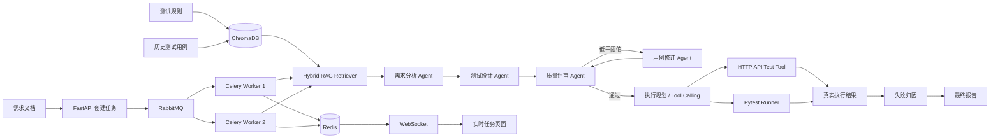

# Req2Test Agent

面向中文需求文档的多智能体 AI 测试设计与执行平台。系统将需求清单、操作手册或产品需求说明转换为结构化测试用例，结合历史测试资产进行 RAG 检索增强，并支持异步任务处理、真实 HTTP API 执行、Pytest 自动化执行和失败归因。

## 核心功能

- 支持 TXT、Markdown、DOCX、可复制文本 PDF
- 需求自动拆分、模块识别与来源追溯
- 测试规则 + 历史测试用例混合知识库
- ChromaDB 持久化向量检索
- 无外部 Embedding API 的离线 Hashing Embedding
- 向量检索不可用时自动回退字符二元组检索
- LangGraph 多节点 Agent 工作流
- 需求分析、测试设计、质量评审和低分自动修订
- 正向、异常、边界测试配置
- FastAPI 异步任务接口
- RabbitMQ + Celery 后台任务队列
- Redis 任务状态、进度和结果缓存
- WebSocket 实时推送任务进度
- 多 Worker 消费与公平预取配置
- Tool Calling 执行规划层
- HTTP API Test Tool 真实请求与断言
- Pytest Runner 自动生成并执行接口测试脚本
- 基于真实执行结果的失败归因
- 云端模型与 Ollama 本地模型兼容
- 无 API Key 的离线演示模式
- Markdown、CSV、JSON 导出

## 系统架构



## 三条核心链路

### 1. RAG 测试知识检索

系统会把两类知识写入本地 ChromaDB：

1. `knowledge/testing_rules.md`：测试设计规范与规则片段。
2. `knowledge/historical_cases.jsonl`：历史测试用例、操作步骤和预期结果。

用户提交需求后，`HybridKnowledgeRetriever` 优先进行向量检索，将相关测试规则和历史案例作为 Test Design Agent 的上下文；ChromaDB 不可用时自动回退到本地字符二元组 + 余弦相似度检索。

当前默认使用确定性的 Hashing Embedding，不依赖外部 Embedding API，便于本地演示、CI 和离线测试。

### 2. 异步任务与实时进度

任务状态大致经历：

```text
queued
→ started
→ retrieval
→ analysis
→ design
→ review
→ revision(可选)
→ generation_completed
→ tool_planning(可选)
→ failure_analysis(可选)
→ completed
```

Redis 保存 `task_id`、任务状态、当前阶段、进度、结果和异常信息；Redis 不可用时开发环境自动回退到内存状态存储。

### 3. Tool Calling + 自动执行

当 `execution_config.enabled=true` 时，生成阶段完成后继续执行：

```text
需求 + 已生成测试用例
        ↓
Execution Planner
        ↓
结构化 HttpTestSpec
        ↓
Tool Dispatcher
   ├── HTTP API Test Tool
   └── Pytest Runner
        ↓
真实 Status Code / JSON / Text / Pytest Result
        ↓
Failure Analyzer
        ↓
execution report
```

执行规划支持三种来源：

- `provided_specs`：调用方明确提供结构化 `api_specs`，确定性最高。
- `llm_tool_planner`：OpenAI-compatible / Ollama 模式下，由模型根据需求中的显式 API 契约生成执行规格。
- `deterministic`：演示模式下直接解析形如 `GET /api/health 状态码: 200` 的接口描述。

为避免模型“编接口”，LLM 规划结果会再次与原需求中明确出现的 HTTP 方法和路径进行白名单比对，不在需求中的 endpoint 会被丢弃。

## 执行安全边界

- HTTP Tool 只接受 `http://` / `https://` Base URL。
- `HttpTestSpec.path` 必须是相对路径，禁止把完整 URL 混入用例 path。
- Pytest Runner **不接受任意 Python 源码**；它只根据已校验的 `HttpTestSpec` 渲染固定测试模板，在临时目录中执行并设置硬超时。
- LLM 失败归因只接收 method、path、状态码和断言失败信息，不发送完整响应正文或认证 Header。
- 测试执行失败不会覆盖掉已经生成的测试用例；工具层异常会作为 execution warning 保存。

## 快速开始

### 1. 创建环境

```bash
python3 -m venv .venv
source .venv/bin/activate
python -m pip install --upgrade pip
pip install -e .
```

Windows PowerShell：

```powershell
.venv\Scripts\Activate.ps1
```

### 2. 初始化 RAG 知识库

```bash
req2test-kb rebuild
req2test-kb stats
```

验证向量检索：

```bash
req2test-kb search --query "用户使用正确账号密码登录" --top-k 3
```

默认数据库位于 `.req2test/chroma`，不会提交到 Git。

### 3. 原有 Streamlit 同步页面

```bash
streamlit run app.py
```

默认进入演示模式，不需要 API Key。

### 4. 启动完整异步平台

推荐使用 Docker Compose：

```bash
docker compose up --build
```

启动后：

- FastAPI：`http://localhost:8000`
- 实时演示页：`http://localhost:8000/demo`
- RabbitMQ 管理页：`http://localhost:15672`，默认账号密码均为 `guest`
- Redis：`localhost:6379`

`/demo` 页面包含一个内置被测接口 `/demo-target/health`，用于演示“生成测试 → HTTP Tool → Pytest → 结果汇总”的完整链路。

如果 Docker Compose 中让 Worker 测试本项目内置接口，Base URL 使用：

```text
http://api:8000
```

本机直接启动 API + Worker 时使用：

```text
http://localhost:8000
```

### 5. 不使用 Docker 时分别启动

先启动 RabbitMQ 和 Redis，然后：

```bash
uvicorn req2test.api:app --reload --port 8000
```

另开终端：

```bash
celery -A req2test.worker.celery_app worker --loglevel=INFO --concurrency=2
```

## API 示例

### 只生成测试用例

```bash
curl -X POST http://localhost:8000/api/v1/tasks \
  -H "Content-Type: application/json" \
  -d '{"requirement_text":"用户可以新增供应商，保存后供应商显示在列表中。"}'
```

### 生成后自动执行显式 API 契约

```bash
curl -X POST http://localhost:8000/api/v1/tasks \
  -H "Content-Type: application/json" \
  -d '{
    "requirement_text":"GET /demo-target/health 状态码: 200 响应包含: {\"status\":\"ok\"}",
    "execution_config":{
      "enabled":true,
      "base_url":"http://localhost:8000",
      "run_http_tool":true,
      "run_pytest":true
    }
  }'
```

也可以直接提供结构化 `api_specs`：

```json
{
  "execution_config": {
    "enabled": true,
    "base_url": "http://localhost:8000",
    "api_specs": [
      {
        "case_id": "API-001",
        "name": "健康检查",
        "method": "GET",
        "path": "/demo-target/health",
        "expected_status": 200,
        "expected_json_contains": {"status": "ok"}
      }
    ]
  }
}
```

任务结果中的 `result.execution` 会包含：

- `executable_cases`
- `tool_calls`
- `http_results`
- `pytest_result`
- `failure_analysis`
- `summary`
- `warnings`

查询状态：

```bash
curl http://localhost:8000/api/v1/tasks/<task_id>
```

WebSocket：

```text
ws://localhost:8000/ws/tasks/<task_id>
```

## 命令行运行

```bash
req2test samples/food_traceability_requirements.md --mode demo --out-dir output
```

输出目录包含：

- `test_cases.md`
- `test_cases.csv`
- `result.json`

## 使用 Ollama

例如：

```bash
ollama pull qwen3:4b
```

配置：

```text
模型名称：qwen3:4b
Base URL：http://localhost:11434/v1
API Key：ollama
```

也可以：

```bash
cp .env.example .env
```

## 运行测试

```bash
pip install -e ".[dev]"
pytest -q
```

测试中包含本机临时 HTTP Server，用于验证 HTTP Tool 和 Pytest Runner 的真实请求链路，不访问公网。

## 项目结构

```text
req2test-agent/
├── app.py
├── Dockerfile
├── docker-compose.yml
├── knowledge/
│   ├── testing_rules.md
│   └── historical_cases.jsonl
├── samples/
│   └── food_traceability_requirements.md
├── src/req2test/
│   ├── api.py
│   ├── worker.py
│   ├── task_store.py
│   ├── progress.py
│   ├── graph.py
│   ├── nodes.py
│   ├── rag.py
│   ├── rag_node.py
│   ├── retrieval.py
│   ├── kb_cli.py
│   ├── execution_models.py
│   ├── tool_calling.py
│   ├── http_tool.py
│   ├── pytest_runner.py
│   ├── models.py
│   ├── document_loader.py
│   ├── exporters.py
│   └── cli.py
├── tests/
│   ├── test_async_platform.py
│   ├── test_rag.py
│   ├── test_tool_execution.py
│   └── test_execution_pipeline.py
└── docs/
```

## 工程化设计说明

- `LangGraph`：编排需求分析、测试设计、质量评审和修订节点。
- `ChromaDB`：持久化测试规则与历史测试用例向量，提供 RAG 上下文。
- `HashingEmbedder`：离线确定性 Embedding，降低演示环境外部依赖。
- `HybridKnowledgeRetriever`：向量检索异常时回退轻量本地检索。
- `RabbitMQ`：解耦 HTTP 请求与耗时 Agent 流程并进行任务削峰。
- `Celery`：负责任务消费、重试与多 Worker 并发；`worker_prefetch_multiplier=1` 避免单 Worker 预取过多任务。
- `Redis`：保存任务状态、实时进度和结果，同时作为 Celery Result Backend。
- `WebSocket`：实时推送任务阶段，避免前端长时间阻塞等待。
- `Execution Planner`：把需求中的显式 API 契约转换为结构化 `HttpTestSpec`。
- `HttpApiTestTool`：执行真实 HTTP 请求并校验状态码、JSON 子结构和正文关键字。
- `PytestRunnerTool`：把同一批结构化规格渲染成固定 Pytest 模板并以子进程执行。
- `Failure Analyzer`：结合真实状态码、连接异常和断言结果进行故障分类；OpenAI-compatible 模式可使用 LLM 进一步归因，失败时回退规则分析。
- `Fallback`：模型、向量检索、Redis 或执行规划失败时均有对应降级路径。

## 下一阶段

- UI 截图 / 原型图多模态需求分析
- 请求幂等、限流与重复任务缓存
- OpenAPI / Swagger 自动导入接口契约
- Jira / 禅道缺陷同步
- 人工确认节点与断点恢复
- 更完整的执行结果 Dashboard

## 可复现评估

```bash
python -m req2test.evaluate
```

报告保存在 `output/evaluation_report.json`。这些指标用于检查输出结构、需求追溯和重复率，不代表真实业务环境中的测试有效性；真实项目仍需结合业务规则和人工评审。

## License

MIT
