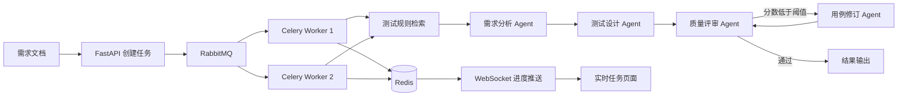

# Req2Test Agent

面向中文需求文档的多智能体测试设计与异步任务平台。系统将需求清单、操作手册或产品需求说明转换为结构化测试用例，并执行覆盖率与完整性评审；同时支持基于 RabbitMQ/Celery 的异步任务处理、Redis 状态管理和 WebSocket 实时进度推送。

## 核心功能

- 支持 TXT、Markdown、DOCX、可复制文本 PDF
- 需求自动拆分与来源编号
- 测试规则本地检索
- LangGraph 多节点 Agent 工作流
- 评审低分自动修订
- 正向、异常、边界测试配置
- Markdown、CSV、JSON 导出
- Streamlit 同步演示界面
- FastAPI 异步任务接口
- RabbitMQ + Celery 后台任务队列
- Redis 任务状态、进度和结果缓存
- WebSocket 实时推送任务进度
- 多 Worker 消费与公平预取配置
- 云端模型与 Ollama 本地模型兼容
- 无 API Key 的离线演示模式

## 系统架构



### 异步任务状态

任务提交后会经历：

```text
queued → started → retrieval → analysis → design → review → revision(可选) → completed
```

Redis 保存 `task_id`、任务状态、当前阶段、进度、结果和异常信息。若 Redis 不可用，开发环境会自动回退到进程内存存储，便于单机调试。

## 快速开始

### 1. 创建环境

```bash
python3 -m venv .venv
source .venv/bin/activate
python -m pip install --upgrade pip
pip install -e .
```

Windows PowerShell：

```powershell
.venv\Scripts\Activate.ps1
```

### 2. 原有 Streamlit 同步页面

```bash
streamlit run app.py
```

默认进入演示模式，不需要 API Key。

### 3. 启动异步任务平台

推荐直接使用 Docker Compose：

```bash
docker compose up --build
```

启动后：

- FastAPI：`http://localhost:8000`
- 实时演示页：`http://localhost:8000/demo`
- RabbitMQ 管理页：`http://localhost:15672`，默认账号密码均为 `guest`
- Redis：`localhost:6379`

在 `/demo` 页面提交需求后，可看到任务从排队、规则检索、需求分析、测试设计、质量评审到完成的实时进度。

### 4. 不使用 Docker 时分别启动

先启动本机 RabbitMQ 和 Redis，然后执行：

```bash
uvicorn req2test.api:app --reload --port 8000
```

另开终端：

```bash
celery -A req2test.worker.celery_app worker --loglevel=INFO --concurrency=2
```

### 5. 异步 API 示例

提交任务：

```bash
curl -X POST http://localhost:8000/api/v1/tasks \
  -H "Content-Type: application/json" \
  -d '{"requirement_text":"用户可以新增供应商，保存后供应商显示在列表中。"}'
```

返回：

```json
{
  "task_id": "...",
  "status_url": "/api/v1/tasks/...",
  "ws_url": "/ws/tasks/..."
}
```

查询状态：

```bash
curl http://localhost:8000/api/v1/tasks/<task_id>
```

WebSocket 地址：

```text
ws://localhost:8000/ws/tasks/<task_id>
```

## 命令行运行

```bash
req2test samples/food_traceability_requirements.md --mode demo --out-dir output
```

输出目录包含：

- `test_cases.md`
- `test_cases.csv`
- `result.json`

## 使用 Ollama

安装 Ollama 后拉取适合本机的中文模型，例如：

```bash
ollama pull qwen3:4b
```

配置：

```text
模型名称：qwen3:4b
Base URL：http://localhost:11434/v1
API Key：ollama
```

也可以复制环境变量模板：

```bash
cp .env.example .env
```

## 运行测试

```bash
pip install -e ".[dev]"
pytest -q
```

## 项目结构

```text
req2test-agent/
├── app.py
├── Dockerfile
├── docker-compose.yml
├── knowledge/testing_rules.md
├── samples/food_traceability_requirements.md
├── src/req2test/
│   ├── api.py
│   ├── worker.py
│   ├── task_store.py
│   ├── progress.py
│   ├── graph.py
│   ├── nodes.py
│   ├── models.py
│   ├── retrieval.py
│   ├── document_loader.py
│   ├── exporters.py
│   └── cli.py
├── tests/
└── docs/
```

## 工程化设计说明

- `LangGraph`：负责编排需求分析、测试设计、质量评审和修订节点。
- `RabbitMQ`：作为任务消息队列，将耗时的测试生成流程从 HTTP 请求中解耦并进行削峰。
- `Celery`：负责 Worker 消费、任务确认、失败重试和多 Worker 并发执行；设置 `worker_prefetch_multiplier=1`，避免单个 Worker 一次占用过多任务。
- `Redis`：保存任务状态、实时进度和结果，同时作为 Celery Result Backend。
- `WebSocket`：将任务阶段和进度实时推送到浏览器，避免前端长时间阻塞等待。
- `FastAPI`：提供任务提交、状态查询、健康检查和 WebSocket 服务。
- `Pydantic`：约束需求、测试用例、评审报告和 API 请求字段。
- `LocalRuleRetriever`：使用字符二元组与余弦相似度检索中文测试规则，无需向量服务。
- `Fallback`：模型失败时回退到本地规则；Redis 不可用时开发模式可回退到内存状态存储。

## 下一阶段

- Chroma/FAISS 历史用例向量知识库与 RAG
- Tool Calling：HTTP API Test Tool、Pytest Runner
- 自动生成并执行接口测试脚本
- UI 截图/原型图多模态需求分析
- 接口限流、请求幂等与重复任务缓存
- Jira/禅道同步
- 人工确认与断点恢复

## 可复现评估

项目内置小型中文需求数据集，用于评估需求数量下限、模块识别、需求追溯覆盖率、结构完整度、重复标题率和运行耗时：

```bash
python -m req2test.evaluate
```

报告保存到 `output/evaluation_report.json`。这些指标主要用于检查输出结构、需求追溯和重复率，不代表真实业务环境中的测试有效性，实际使用仍需结合业务规则和人工评审。

## License

MIT
