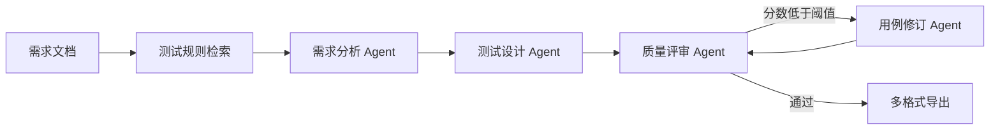

# Req2Test Agent

面向中文需求文档的多智能体测试设计平台。系统将需求清单、操作手册或产品需求说明转换为结构化测试用例，并执行覆盖率与完整性评审。

## 核心功能

- 支持 TXT、Markdown、DOCX、可复制文本 PDF
- 需求自动拆分与来源编号
- 测试规则本地检索
- 多节点 Agent 工作流
- 评审低分自动修订
- 正向、异常、边界测试配置
- Markdown、CSV、JSON 导出
- Streamlit 可视化界面
- 云端模型与 Ollama 本地模型兼容
- 无 API Key 的离线演示模式

## 系统架构



## 快速开始

### 1. 创建环境

```bash
python3 -m venv .venv
source .venv/bin/activate
python -m pip install --upgrade pip
pip install -e .
```

Windows PowerShell 激活命令：

```powershell
.venv\Scripts\Activate.ps1
```

### 2. 启动页面

```bash
streamlit run app.py
```

默认进入演示模式，不需要 API Key。页面会自动载入食品溯源系统示例需求。

### 3. 命令行运行

```bash
req2test samples/food_traceability_requirements.md --mode demo --out-dir output
```

输出目录包含：

- `test_cases.md`
- `test_cases.csv`
- `result.json`

## 使用 Ollama

安装 Ollama 后拉取适合本机的中文模型，例如：

```bash
ollama pull qwen3:4b
```

启动模型服务后，在页面中设置：

```text
模型名称：qwen3:4b
Base URL：http://localhost:11434/v1
API Key：ollama
```

也可以复制环境变量模板：

```bash
cp .env.example .env
```

## 运行测试

```bash
pip install -e ".[dev]"
pytest -q
```

## 项目结构

```text
req2test-agent/
├── app.py
├── knowledge/testing_rules.md
├── samples/food_traceability_requirements.md
├── src/req2test/
│   ├── graph.py
│   ├── nodes.py
│   ├── models.py
│   ├── retrieval.py
│   ├── document_loader.py
│   ├── exporters.py
│   └── cli.py
├── tests/
└── docs/
```

## 设计说明

- `LangGraph`：负责编排节点、共享状态和评审条件路由。
- `Pydantic`：约束需求、测试用例和评审报告字段。
- `LocalRuleRetriever`：使用字符二元组与余弦相似度检索中文测试规则，无需向量服务。
- `OpenAI-compatible API`：统一连接 OpenAI、兼容服务和 Ollama。
- `Fallback`：模型失败时回退到本地规则，保证演示稳定。

## 下一阶段

- Playwright MCP 自动执行用例
- Chroma 历史用例库和相似用例去重
- Jira/禅道同步
- 人工确认与断点恢复
- 生成自动化测试脚本

## License

MIT

## 可复现评估

项目内置小型中文需求数据集，用于评估需求数量下限、模块识别、需求追溯覆盖率、结构完整度、重复标题率和运行耗时：

```bash
python -m req2test.evaluate
```

报告保存到 `output/evaluation_report.json`。这些指标主要用于检查输出结构、需求追溯和重复率，不代表真实业务环境中的测试有效性。实际使用时仍需结合业务规则和人工评审。
