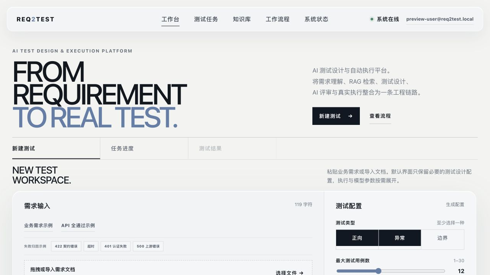
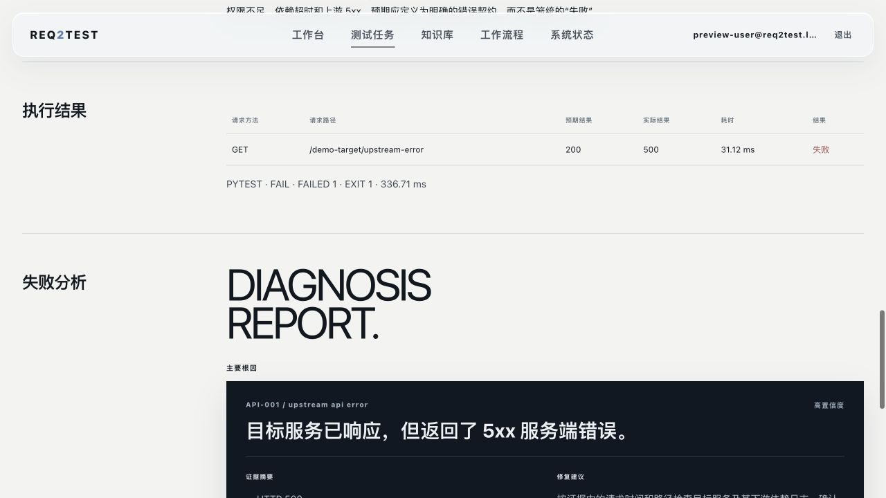
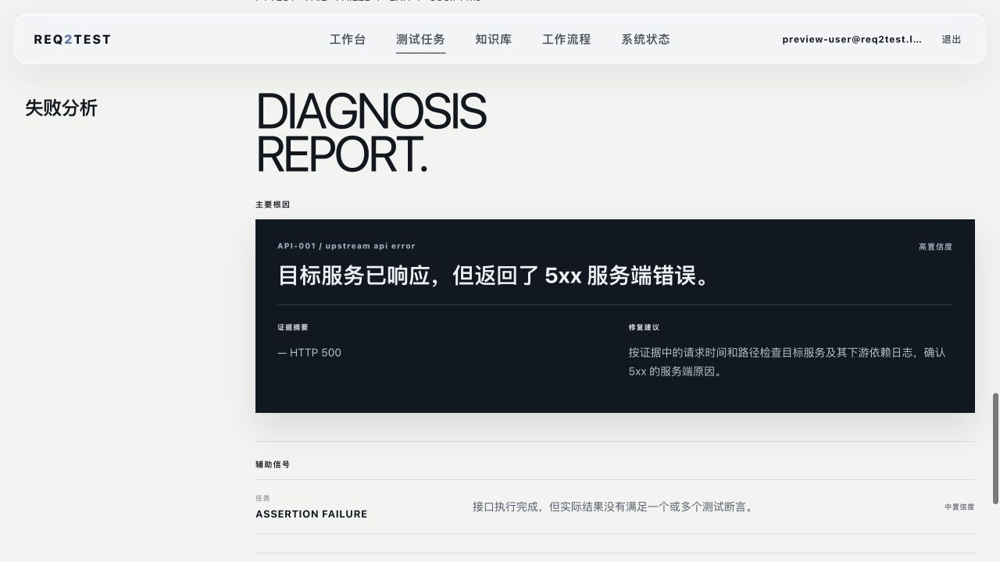
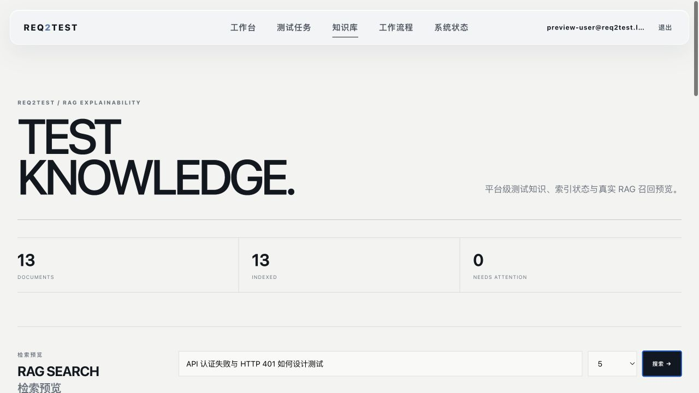
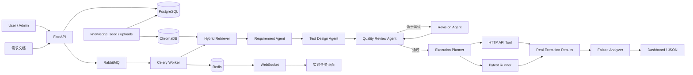

# Req2Test Agent · AI 测试执行平台

面向中文需求文档的多智能体 AI 测试设计与执行平台。系统将需求解析、RAG 测试知识检索、测试用例生成、质量评审、真实 HTTP 执行、Pytest 自动化和失败归因串成一个可复现的测试闭环。


## 系统预览

以下截图来自本仓库当前 FastAPI Web 平台的真实本地运行环境，使用仅用于公开预览的本地测试账户与内置可执行 API 场景。

### 工作台 · 需求输入与测试配置



### 测试任务详情 · Execution 执行结果



### Failure Analysis V2 · Diagnosis Report



### Knowledge Base · RAG 检索与知识文档



## 项目解决什么问题

单纯生成测试文本无法覆盖真实测试工程中的执行、追踪和诊断需求。Req2Test Agent 进一步解决三个工程问题：

1. **测试设计可追溯**：需求被结构化为 Requirement，每条测试用例保留来源需求，并通过质量评审节点检查覆盖率和完整性。
2. **长任务可工程化运行**：FastAPI + RabbitMQ + Celery + Redis 将耗时 Agent 流程异步化，WebSocket 实时推送任务阶段。
3. **生成结果可以真实执行并沉淀**：Execution Planner 把需求中的 API 契约转换为 `HttpTestSpec`，HTTP Tool 与 Pytest Runner 真实执行；任务、用例、执行和知识目录长期保存在 PostgreSQL。

## 核心能力

- TXT、Markdown、DOCX、可复制文本 PDF 需求解析
- Requirement 自动拆分、模块识别与来源追溯
- LangGraph 多 Agent：需求分析、测试设计、质量评审、自动修订
- 正向 / 异常 / 边界测试配置
- PostgreSQL 永久保存用户、任务、测试用例、执行记录与知识文档目录
- ChromaDB 持久化 RAG：13 份内置测试知识、用户上传文档与分块向量
- 离线 Hashing Embedding，向量检索失败时回退本地轻量检索
- FastAPI 异步任务接口
- RabbitMQ + Celery 后台任务与多 Worker 消费
- Redis 保存任务状态、实时进度与结果
- WebSocket 实时任务进度
- Tool Calling / Execution Planner
- HTTP API Tool：真实请求、状态码、JSON 子结构和正文断言
- Pytest Runner：根据结构化规格生成固定测试模板并真实执行
- Failure Analyzer：连接、超时、认证、路由、422 契约校验、5xx、断言失败等归因
- Failure Analysis V2：确定性根因分类、证据快照、置信度及 Primary / Secondary 层级
- JWT 登录、普通用户任务隔离、RBAC 与 Admin 管理控制台
- Knowledge Base：文档上传、索引状态、真实 RAG 搜索、删除与重建
- Demo / OpenAI-compatible / Ollama 运行模式
- Markdown / CSV / JSON 导出
- Docker Compose 一键启动演示环境

## 系统架构



更详细的设计说明见 [`docs/architecture.md`](docs/architecture.md)。

## 已完成的本地验收

2026-08-14 在 macOS Apple Silicon + Docker Desktop 环境完成真实集成验收。

### 自动化回归

```text
131 passed
```

### RAG

- Chroma backend 正常
- 13 份内置知识文档写入 PostgreSQL 目录
- 39 个 Markdown chunks 写入 ChromaDB
- 初始化幂等，支持上传、删除、重新索引与全库重建
- Workbench 与 Knowledge 页面使用同一套 Chroma collection

### Demo A：全通过链路

```text
HTTP 用例：2
HTTP 通过：2
HTTP 失败：0
Pytest：PASS
http_pass_rate：1.0
```

### Demo B：失败归因

故意省略 POST 必填请求体：

```text
GET /demo-target/health：PASS，200 -> 200
POST /demo-target/echo：FAIL，200 -> 422
Pytest：FAIL
Failure Analysis：contract_mismatch
```

完整验收记录见 [`docs/acceptance.md`](docs/acceptance.md)。

## 快速开始

### 1. 本地 Python 环境

```bash
python3 -m venv .venv
source .venv/bin/activate
python -m pip install --upgrade pip
pip install -e ".[dev]"
pytest -q
```

支持 Python `>=3.10,<3.14`。

### 2. 本地基础设施与配置

```bash
cp .env.example .env
openssl rand -hex 32
```

把生成值写入 `.env` 的 `JWT_SECRET_KEY`。仅在本机 HTTP 开发环境将
`AUTH_COOKIE_SECURE=false`；HTTPS 部署必须保持 `true`。`.env` 不会提交到 Git。

### 3. 启动完整平台

首次构建：

```bash
docker compose build
docker compose up -d
```

启动链路会等待 PostgreSQL、Redis 和 RabbitMQ 健康，执行 Alembic migration，随后幂等导入 `knowledge_seed/`，再启动 FastAPI 与 Celery Worker。

之后如果只修改 `src/`，开发环境通过 `docker-compose.override.yml` 挂载本地代码，通常直接执行：

```bash
docker compose up
```

即可，无需重复下载整套 Python 依赖。

启动后：

- FastAPI：`http://localhost:8000`
- 工作台：`http://localhost:8000/workbench`
- 知识库：`http://localhost:8000/knowledge`
- 系统状态：`http://localhost:8000/system`
- 健康检查：`http://localhost:8000/health`
- Demo Dashboard：`http://localhost:8000/demo`
- RabbitMQ Management：`http://localhost:15672`，本地默认账号密码均为 `guest`
- Redis：`localhost:6379`

### 4. 登录与 Admin 初始化

普通用户可在 `http://localhost:8000/register` 注册。项目不会创建默认管理员，也不会内置管理员密码；首次初始化 Admin 使用交互命令：

```bash
docker compose exec api python -m req2test.cli.create_admin
```

命令会交互读取邮箱和密码，不会把密码写入 shell history。Admin 可管理用户状态与角色、查看平台任务、知识库和系统状态。

### 5. Knowledge Base 初始化与检索

Docker Compose 的 `migrate` 服务会自动执行一次幂等 seed。手动运行或复查：

```bash
docker compose exec api python -m req2test.kb_cli seed
docker compose exec api python -m req2test.kb_cli stats
docker compose exec api python -m req2test.kb_cli search --query "401 token 过期" --top-k 3
```

默认 Chroma 持久化目录为 `.req2test/chroma`；Docker 使用命名 volume。两者均不提交到 Git。

在 Docker Compose 中让 Worker 测试内置 Demo API 时，Base URL 使用：

```text
http://api:8000
```

## 两个推荐 Demo

页面：`http://localhost:8000/demo`

### 全通过 Demo

```text
GET /demo-target/health
预期状态码：200
响应包含：{"status":"ok"}

POST /demo-target/echo
请求体：{"message":"hello"}
预期状态码：200
响应包含：{"status":"ok"}
```

预期：2/2 HTTP PASS，Pytest PASS。

### 失败归因 Demo

```text
GET /demo-target/health
预期状态码：200
响应包含：{"status":"ok"}

POST /demo-target/echo
预期状态码：200
```

因为 POST 缺少请求体，FastAPI 返回 422。平台应将该用例标记为 FAIL，并归因为 `contract_mismatch`，而不是把整个异步任务误判为系统失败。

## API

### 创建异步任务

任务 API 默认需要认证。先注册或登录并取得 access token：

```bash
TOKEN=$(curl -sS -X POST http://localhost:8000/api/v1/auth/login \
  -H "Content-Type: application/json" \
  -d '{"email":"your-user@example.com","password":"your-local-password"}' \
  | python -c 'import json,sys; print(json.load(sys.stdin)["access_token"])')
```

```bash
curl -X POST http://localhost:8000/api/v1/tasks \
  -H "Authorization: Bearer $TOKEN" \
  -H "Content-Type: application/json" \
  -d '{
    "requirement_text":"GET /demo-target/health 状态码: 200 响应包含: {\"status\":\"ok\"}",
    "execution_config":{
      "enabled":true,
      "base_url":"http://localhost:8000",
      "run_http_tool":true,
      "run_pytest":true
    }
  }'
```

返回 `task_id` 后可以查询：

```text
GET /api/v1/tasks/<task_id>
WS  /ws/tasks/<task_id>
```

任务结果中的 `result.execution` 包含：

- `executable_cases`
- `tool_calls`
- `http_results`
- `pytest_result`
- `failure_analysis`
- `summary`
- `warnings`

## RAG 与 Knowledge Base 设计

知识来源分为：

- `knowledge_seed/`：13 份可提交的内置 Markdown，覆盖测试设计、API、Pytest、安全与 Failure Analysis
- 用户通过 Knowledge 页面上传的 TXT / Markdown / DOCX / PDF
- `knowledge/`：保留的早期静态规则，仅作为本地检索降级资料

每份产品知识在 PostgreSQL `knowledge_documents` 保存 metadata、索引状态与 chunk 数，内容按 Markdown 标题分块后写入同一个 Chroma collection。`HybridKnowledgeRetriever` 优先使用该 collection，失败时回退本地规则。默认 Hashing Embedding 用于离线演示和确定性测试，不等同于生产级语义 Embedding。

`knowledge_seed/` 内容是基于 pytest、OWASP WSTG、OpenAPI、RFC 9110 与常见测试设计方法整理的原创摘要；每份文件均声明 `source`、`license` 和 `version` 元数据，不包含大段复制原文或第三方品牌资产。

## Tool Calling 安全边界

- Execution Planner 只接受需求文本中明确出现的 HTTP method/path。
- LLM 规划结果会再次与原始 endpoint 白名单比对，过滤模型编造接口。
- HTTP Tool 默认限制允许访问的 Host，降低 SSRF 风险。
- `HttpTestSpec.path` 必须为相对路径。
- Pytest Runner 不接受任意 Python 源码，只渲染固定模板，并设置执行超时。
- Failure Analyzer 不向模型发送认证 Header 或完整响应正文。
- 测试执行失败与平台任务失败分离：被测接口 FAIL 仍会保存完整执行报告。
- Docker 中 API / Celery Worker 使用非 root 用户运行。

## 项目结构

```text
req2test-agent/
├── app.py                     # Legacy Streamlit Demo（保留兼容入口）
├── Dockerfile
├── docker-compose.yml
├── docker-compose.override.yml
├── knowledge/
│   ├── testing_rules.md
│   └── historical_cases.jsonl
├── knowledge_seed/            # 13 份内置、可追溯的产品知识
├── alembic/                   # PostgreSQL schema migrations
├── samples/
├── src/req2test/
│   ├── api.py
│   ├── demo_ui.py
│   ├── worker.py
│   ├── task_store.py
│   ├── db/                    # SQLAlchemy 2.x models/repositories/session
│   ├── services/              # persistence, knowledge and admin services
│   ├── security/              # Argon2 password, JWT and RBAC
│   ├── progress.py
│   ├── graph.py
│   ├── enhanced_nodes.py
│   ├── rag.py
│   ├── rag_node.py
│   ├── retrieval.py
│   ├── execution_models.py
│   ├── tool_calling.py
│   ├── http_tool.py
│   ├── pytest_runner.py
│   └── ...
├── tests/
├── docs/
│   ├── architecture.md
│   └── acceptance.md
└── .github/workflows/tests.yml
```

## Legacy Streamlit Demo

根目录 `app.py` 是项目早期的 Streamlit 交互入口，为兼容既有使用方式而保留。当前正式产品入口是 `src/req2test/api.py` 提供的 FastAPI 服务及 `/workbench`、`/tasks`、`/knowledge`、`/system` Web 页面；Docker Compose 也以 FastAPI + Celery 架构启动。Legacy 入口不代表当前平台的持久化、认证或异步执行架构。

## 运行模式

### Demo

默认本地演示模式，不需要 API Key。

### OpenAI-compatible / Ollama

可通过 `.env` 或页面配置 OpenAI-compatible endpoint；Ollama 也可以使用兼容 API 接入。

示例：

```bash
cp .env.example .env
ollama pull qwen3:4b
```

## 设计取舍

- **RabbitMQ**：把 HTTP 请求与耗时 Agent 工作流解耦，并支持任务削峰。
- **Celery**：处理 Worker 消费、多任务并发与重试。
- **PostgreSQL**：用户、任务、测试用例、执行与知识目录的永久 Source of Truth。
- **Redis**：实时任务状态、进度投影与 Celery Result Backend；不替代 PostgreSQL 历史数据。
- **WebSocket**：避免浏览器同步阻塞等待长任务。
- **LangGraph**：显式表达 Agent 节点、状态和条件修订路径。
- **Pydantic**：约束需求、测试用例和执行报告的数据结构。
- **ChromaDB**：将可管理的测试知识资产接入生成流程，而不是只依赖模型输入上下文。
- **规则降级**：模型、向量检索或 LLM 失败归因不可用时，仍能维持可演示主流程。

## 当前边界与后续方向

当前项目重点验证“需求 → 测试设计 → 自动执行 → 失败归因”的工程闭环，不将 Demo 环境包装成生产级测试平台。

可继续扩展：

- OpenAPI / Swagger 自动导入 API 契约
- UI 截图 / 原型图多模态需求分析
- 限流和跨区域部署策略
- Jira / 禅道缺陷同步
- 人工确认节点与断点恢复
- 更完整的历史执行趋势与质量 Dashboard

## License

MIT
