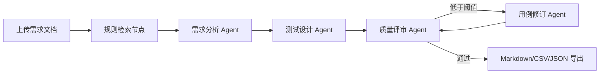

# 系统设计

## 工作流

## 关键设计

1. **状态图编排**：使用 LangGraph 表达节点、状态和条件路由，评审得分低于阈值时触发一次修订。
2. **结构化数据契约**：使用 Pydantic 约束需求、用例步骤和评审报告，减少大模型自由文本造成的字段漂移。
3. **本地知识检索**：将中文测试规范拆成规则片段，使用字符二元组和余弦相似度检索相关规则。
4. **双运行模式**：演示模式完全离线；OpenAI 兼容模式可连接云端模型或 Ollama。
5. **可追溯性**：每条用例记录来源需求编号，评审节点计算需求覆盖率。
6. **降级策略**：模型调用或 JSON 解析失败时，自动回退到本地规则生成，保证演示可用。
