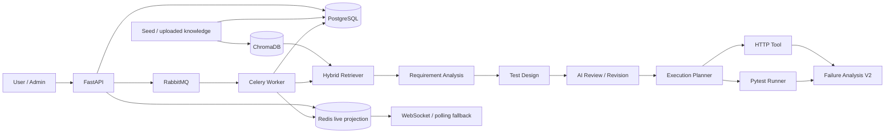

# Req2Test Agent 系统架构

## 项目定位

Req2Test Agent 将中文需求解析、RAG、测试设计、真实 HTTP/Pytest 执行和证据化失败归因组织为可持久化的异步测试工程链路。

## 总体架构

## 数据与消息职责

- **PostgreSQL**：User、Task、TestCase、Execution、KnowledgeDocument 和诊断结果的长期 Source of Truth。
- **Redis**：高频进度、WebSocket 实时投影、临时缓存和 Celery Result Backend；投影可从 PostgreSQL 恢复。
- **RabbitMQ**：FastAPI 与 Celery Worker 之间的异步任务 broker。
- **ChromaDB**：KnowledgeDocument 内容分块后的向量与检索 metadata，不保存用户或任务业务关系。

## 工作流

LangGraph 管理需求分析、测试设计、质量评审和条件修订。Execution Planner 只接受需求中明确出现的 HTTP method/path，并通过 endpoint 白名单约束模型输出。HTTP Tool 校验状态码、JSON 子结构和正文；Pytest Runner 从结构化规格渲染固定模板，不接受任意 Python 源码。

Worker 在关键生命周期节点持久化 PostgreSQL，在执行期间向 Redis 写入单调版本的进度。有限重试只用于瞬时基础设施异常；确定性的业务失败不会盲目重试。Task terminal state、稳定 task/celery ID 与数据库唯一约束共同防止重复 delivery 产生重复执行记录。

## Knowledge Base

`knowledge_seed/` 的 13 份 Markdown 和管理员上传文档统一进入 PostgreSQL 目录。服务按 Markdown 标题切块，将稳定 parent/chunk ID 写入同一 Chroma collection。检索返回 top-k、相似度、source 和 snippet；Workbench 与 Knowledge 页面调用同一检索链路。Chroma 不可用时，工作流可回退到本地规则检索。

## Authentication 与管理

用户密码使用 Argon2 哈希，JWT 可通过 HttpOnly cookie 或 Bearer token 使用。每次受保护请求都会从 PostgreSQL 重新确认用户状态和角色；Task 查询按 owner 隔离，Admin API 使用服务端 RBAC。项目不创建默认管理员，管理员通过交互 CLI 显式初始化。

## Failure Analysis V2

分类器根据真实状态码、异常类型、耗时和响应证据识别 `contract_mismatch`、`timeout`、`authentication_error`、`upstream_api_error` 等根因。更具体的确定性根因作为 Primary，assertion/Pytest failure 等执行信号作为 Secondary。证据写入前会脱敏并限制大小。

## 安全边界

- HTTP Tool 使用允许访问的 host 列表并拒绝带凭据 URL，降低 SSRF 风险。
- API path 必须是相对路径；模型规划结果再次与原始 endpoint 白名单核对。
- Failure Analysis 不向模型发送认证 Header 或完整响应正文。
- Docker 中 API 与 Worker 使用非 root 用户。
- Cookie mutation 的 CSRF 限制见 [`SECURITY.md`](../SECURITY.md)。
