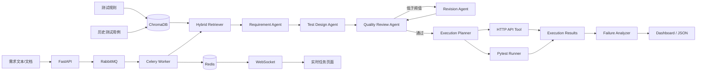

# Req2Test Agent 系统架构

## 1. 项目定位

Req2Test Agent 是面向中文需求文档的多智能体 AI 测试设计与执行平台。系统不只生成测试用例，还将 RAG、异步任务、真实 HTTP 执行、Pytest 自动化和失败归因串成完整测试闭环。

## 2. 总体架构

## 3. 核心模块

### LangGraph 工作流

LangGraph 管理需求分析、测试设计、质量评审和条件修订。Pydantic 为 Requirement、TestCase、ExecutionReport 等对象提供结构化数据契约，降低模型自由文本导致的字段漂移。

### RAG 测试知识库

测试规范和历史测试用例进入 ChromaDB。默认使用离线 Hashing Embedding，避免演示依赖额外 Embedding API；向量数据库不可用时回退本地字符二元组检索。

### 异步任务平台

FastAPI 接受请求后立即创建 `task_id`，RabbitMQ 负责队列解耦与削峰，Celery Worker 执行耗时 Agent 流程，Redis 保存状态、进度和结果。WebSocket 将状态实时推送到页面，避免同步 HTTP 长连接等待。

### Tool Calling 执行层

Execution Planner 只从需求里明确出现的 HTTP 方法和路径构造 `HttpTestSpec`。LLM 模式下仍会通过显式 endpoint 白名单二次校验，防止模型编造接口。

`HttpApiTestTool` 执行真实请求并校验状态码、JSON 子结构和正文关键字。`PytestRunnerTool` 根据已校验规格渲染固定 Pytest 模板，在受限临时目录中以子进程执行，不接收任意 Python 源码。

### Failure Analyzer

根据真实状态码、连接异常、超时和断言失败进行归因。401/403、404、422、5xx 等场景分别进入对应类别；OpenAI-compatible 模式可进一步使用模型分析，失败时自动回退规则归因。

## 4. 安全边界

- HTTP Tool 默认限制允许访问的 Host，降低 SSRF 风险。
- API path 必须使用相对路径。
- Pytest Runner 不接受调用方传入任意代码。
- LLM 失败归因不会发送认证 Header 或完整响应正文。
- Docker 容器使用非 root 用户运行应用和 Celery Worker。
- 模型、Redis、向量检索和执行规划均设计了降级路径。

## 5. 两个可复现演示场景

### Demo A：成功闭环

两条显式 API 契约执行后得到：2/2 HTTP PASS，Pytest PASS，失败归因为空。

### Demo B：失败归因

故意不给 POST 接口必填请求体，服务端返回 422。系统保留测试任务成功状态，同时将接口用例标记 FAIL，并归因为 `contract_mismatch`。

详细验收结果见 [`docs/acceptance.md`](acceptance.md)。
